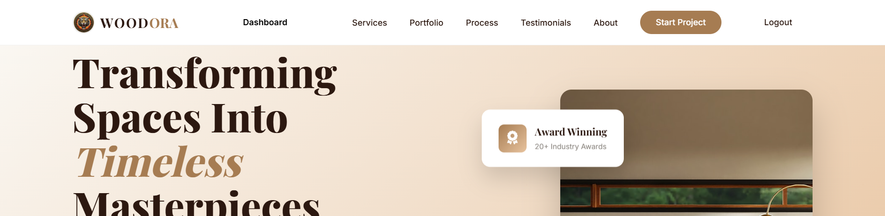
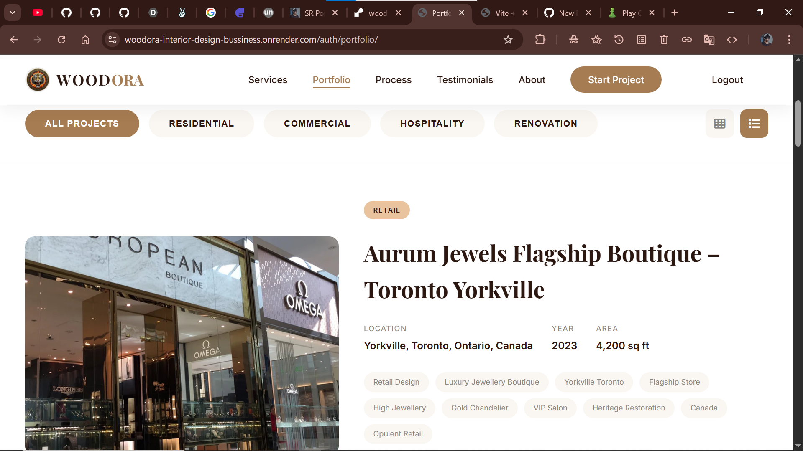
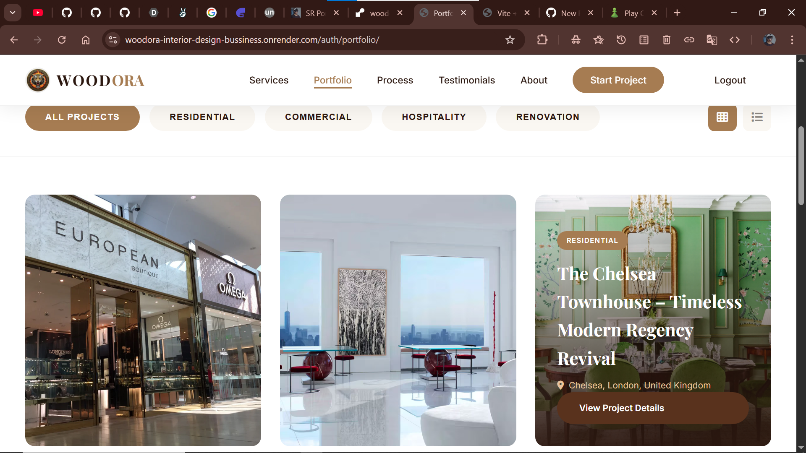
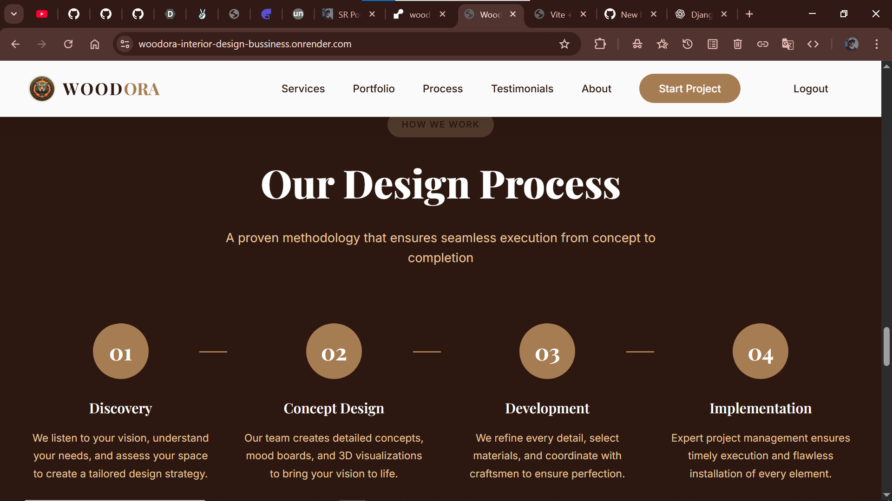
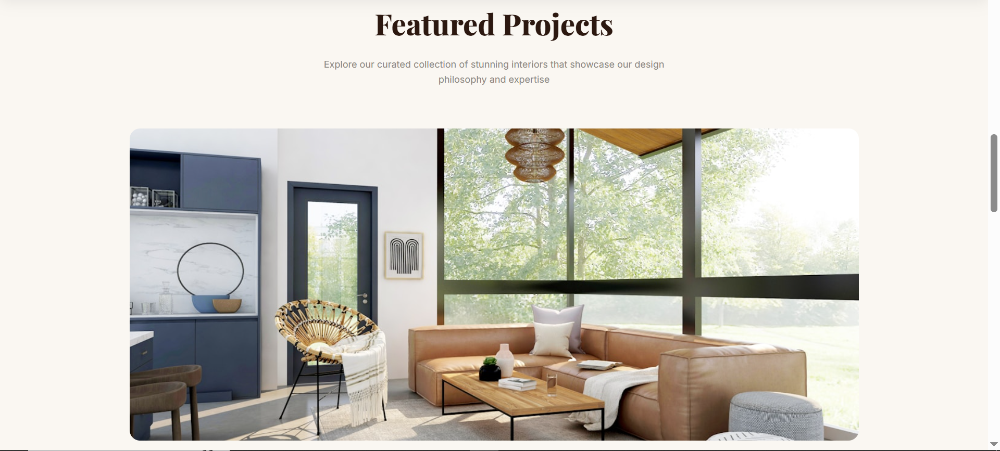
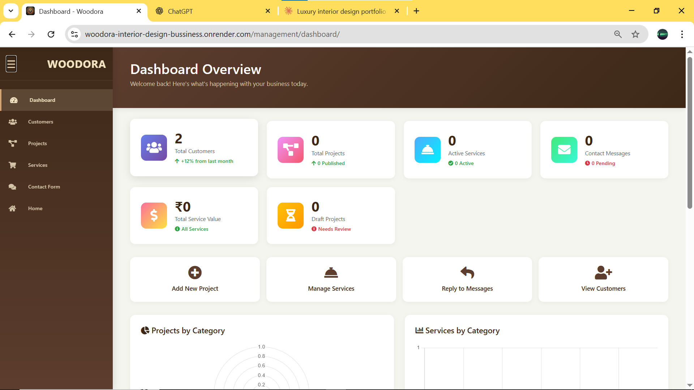
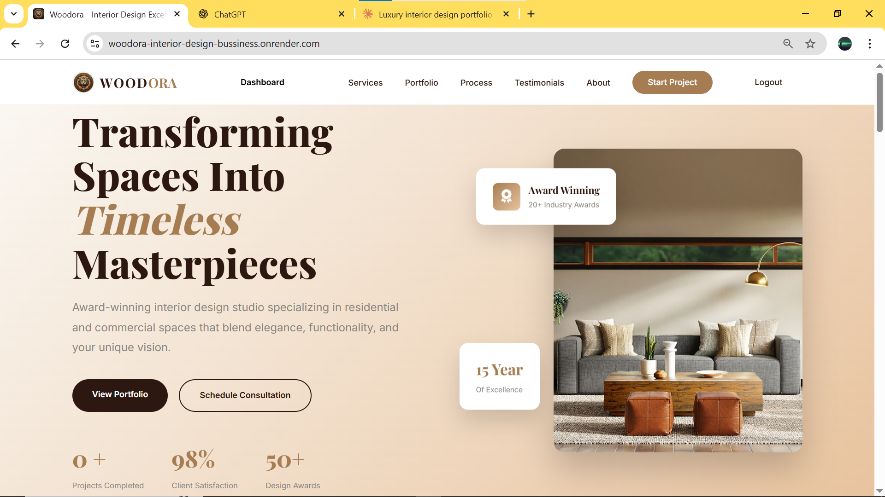
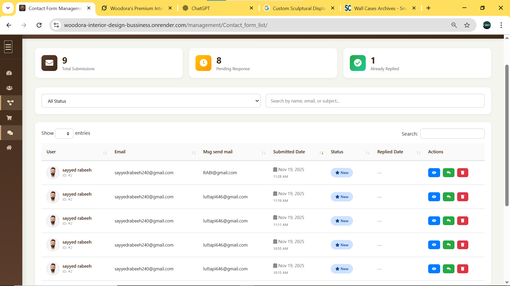
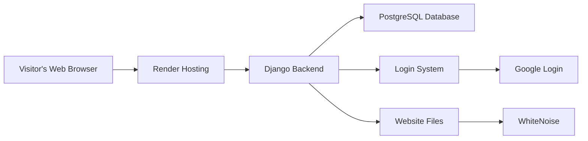
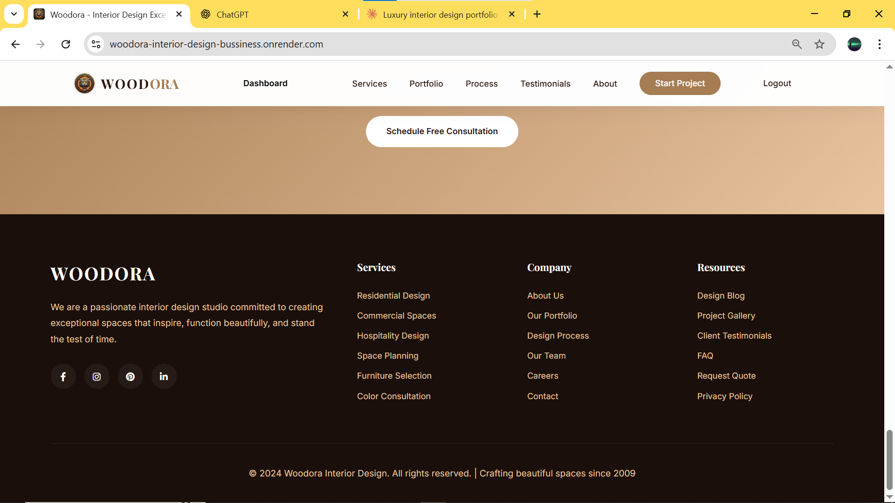

<div align="center">

 

 **⭐ Give this project a star if you like it!**

#  **WOODORA**

### *Luxury Interior Design Portfolio Website*

**A Professional Interior Design Business Platform**

[](https://woodora-interior-design-bussiness.onrender.com)
[](https://www.djangoproject.com/)
[](https://neon.tech/)
[](https://render.com/)

---

*A beautiful website for interior design businesses*

[Visit Live Website](https://woodora-interior-design-bussiness.onrender.com) • [See Features](#-what-you-get) • [Technology](#-what-we-used)

</div>

---

##  **What Is This Project?**

**WOODORA** is a complete website for interior design businesses. It helps designers show their work, talk to clients, and run their business online. Everything is easy to use and looks professional.

<div align="center" style="
    padding: 30px;
    margin: 30px 0;
    border-radius: 16px;
    border: 1px solid #e5e5e5;
">

  

  

  <p><i>Beautiful designs. Simple to use. Professional results.</i></p>

</div>


---

##  **What You Get**

###  **For Website Visitors (Your Customers)**

<table>
<tr>
<td width="50%">

#### **Nice Looking Website**
- Beautiful home page 
- Photo galleries showing your work
- Easy to read text and colors
- Smooth page changes

</td>
<td width="50%">



</td>
</tr>
</table>

###  **What Visitors Can See**

Your work is shown in the best way:

- **Project Photos** - Clear, high-quality pictures of your completed projects
- **Services List** - What you offer and how much it costs
- **Contact Form** - Easy way for people to message you
- **User Login** - People can sign in with their Google account

<div align="center">



</div>

---

###  **Control Panel (For You, The Owner)**

An easy control panel to manage everything:

<table>
<tr>
<td width="33%" align="center">



** See Your Numbers**

Check your business stats:
- How many projects you have
- Messages from customers
- People who signed up
- Which services people view

</td>
<td width="33%" align="center">



** Update Your Content**

Change things easily:
- Add, edit, or delete projects
- Upload many photos at once
- Change your services
- Manage users

</td>
<td width="33%" align="center">



** Handle Customer Messages**

Stay organized:
- Read all messages
- See contact form entries
- Delete spam messages
- Keep customer information

</td>
</tr>
</table>

---

##  **What We Used to Build This**

<div align="center">

### *Built with Good Tools*

</div>



### **Technology Details**

<table>
<tr>
<td width="50%">

#### **Server Side (Backend)**
```yaml
Framework: Django 5.2
Database: PostgreSQL (Neon Cloud)
Login System: Django Allauth + Google Login
Data Storage: Django ORM
Hosting: Render.com
Security: SSL (Secure Connection)
Status: Ready for Real Use
```

</td>
<td width="50%">

#### **What People See (Frontend)**
```yaml
Page Structure: HTML5
Design: CSS3 + Bootstrap 5
Interactions: JavaScript
Icons: Font Awesome
Fonts: Google Fonts
 
```

</td>
</tr>
</table>

<div align="center">

 

</div>

---

##  **How We Store Information**

### **Database Setup**

<table>
<tr>
<td width="50%">

#### **Project Details**
```python
class Project(models.Model):
    title = CharField()
    description = TextField()
    category = CharField()
    year = IntegerField()
    location = CharField()
    area = DecimalField()
    cover_image = ImageField()
    gallery_images = ManyToMany()
    created_at = DateTimeField()
```

</td>
<td width="50%">

#### **Service Details**
```python
class Service(models.Model):
    title = CharField()
    description = TextField()
    price = DecimalField()
    image = ImageField()
    is_featured = BooleanField()
    created_at = DateTimeField()
```

</td>
</tr>
</table>

---

##  **How the Website Goes Online**

<div align="center">

 

### **Automatic Publishing**

</div>

```
┌─────────────┐        ┌──────────────┐        ┌─────────────┐
│   GitHub    │ ────▶  │  Render.com  │ ────▶  │  Neon DB    │
│   Code      │  Push  │  Auto Upload │  SSL   │  Database   │
└─────────────┘        └──────────────┘        └─────────────┘
                              │
                              ▼
                       ┌──────────────┐
                       │  Live Site   │
                       │   🌍 Online  │
                       └──────────────┘
```

**What This Does:**
-  **No Website Breaks** — Changes happen smoothly
-  **Safe Connection** — Your data is protected
-  **Fast Loading** — Pages load quickly
-  **Always Watching** — We check if everything works
-  **Auto Save** — Your information is backed up

---

##  **Problems  Fixed**

### **Technical Issues  Solved**

<table>
<tr>
<td width="50%">

####  **Problem: Host Error**
```
Error: Website address not allowed
Solution: Fixed the settings
```
```python
ALLOWED_HOSTS = [
    host.strip() 
    for host in os.environ.get(
        'ALLOWED_HOSTS', ''
    ).split(',')
]
```

</td>
<td width="50%">

####  **Problem: Database Won't Connect**
```
Error: Can't connect to database
Solution: Added secure connection
```
```python
DATABASES = {
    'default': dj_database_url.config(
        conn_max_age=600,
        ssl_require=True
    )
}
```

</td>
</tr>
</table>

 

---

##  **Folder Organization**

```
woodora-interior-design-business/
│
├──  myproject/                 # Main settings
│   ├── settings.py               # Website settings
│   ├── urls.py                   # Page links
│   └── wsgi.py                   # Server setup
│
├──  authentication/            # Login system
│   ├── models.py                 # User information
│   ├── views.py                  # Login pages
│   └── templates/                # Login design
│
├──  projects/                  # Project pages
│   ├── models.py                 # Project information
│   ├── views.py                  # Project pages
│   └── templates/                # Project design
│
├──  services/                  # Services section
│   ├── models.py                 # Service information
│   └── views.py                  # Service pages
│                 
│
├──  templates/                 # Page designs
│   ├── base.html                 # Main layout
│   ├── index.html                # Home page
│   └── components/               # Reusable parts
│
├──  static/                    # Website files
│   ├── css/                      # Styles
│   ├── js/                       # Scripts
│   └── images/                   # Pictures
│
├──  media/                     # Uploaded files
│   ├── projects/                 # Project photos
│   └── services/                 # Service photos
│
└──  requirements.txt           # Software list
```

---

##  **How to Set It Up**

### **What You Need**
```bash
Python 3.11 or newer
PostgreSQL 14 or newer
Git
```

### **Setup Steps**

```bash
#  Download the code
git clone https://github.com/sayyedrabeeh/woodora-interior-design-bussiness-portfolio.git
cd woodora-interior-design-bussiness-portfolio

#  Make a virtual environment
python -m venv venv
source venv/bin/activate  # On Windows: venv\Scripts\activate

#  Install needed software
pip install -r requirements.txt

#  Set up your details
cp .env.example .env
# Edit .env file with your information

#  Set up database
python manage.py migrate

#  Make admin account
python manage.py createsuperuser

#  Get website files ready
python manage.py collectstatic --noinput

#  Start the website
python manage.py runserver
```

<div align="center">

** Open your browser and go to:** `http://localhost:8000`
</div>

---

##  **Why This Helps Your Business**

<table>
<tr>
<td width="33%" align="center">

###  **Look More Professional**
A good website shows you do quality work
</td>
<td width="33%" align="center">

###  **Get More Customers**
Easy way to show your work and get new clients

</td>
<td width="33%" align="center">

###  **Save Time**
Manage everything from one place

</td>
</tr>
</table>

<div align="center">


### **Main Features**

** Google Friendly** • ** Safe & Secure** 

</div>

---

 
---

##  **Want to Help Make This Better?**

Everyone can help! You can fix problems, add new things, or make the guides better.

**How to Help:**
1. Copy (Fork) this project
2. Make a new branch (`git checkout -b feature/NewThing`)
3. Save your changes (`git commit -m 'Add NewThing'`)
4. Upload to GitHub (`git push origin feature/NewThing`)
5. Ask us to add it (Pull Request)

---

##  **License**

```
MIT License

Copyright (c) 2024 WOODORA Interior Design

You can use this code for free in your own projects.
See LICENSE file for all details.
```

[Read Complete License](LICENSE)

---

<div align="center">

##  **Why WOODORA Is Good**

*Nice design + smart technology*



---

### **Need Extra Help?**

**Want to make WOODORA even better for your business?**

 

---

**Made with ♥️ by [Sayyed Rabeeh](https://github.com/sayyedrabeeh)**

[](https://github.com/sayyedrabeeh)
[](https://www.linkedin.com/in/sayyed-rabeeh/)
[](https://portfolio-fronted-static.onrender.com)

---

**⭐ Give this project a star if you like it!**

</div>


 